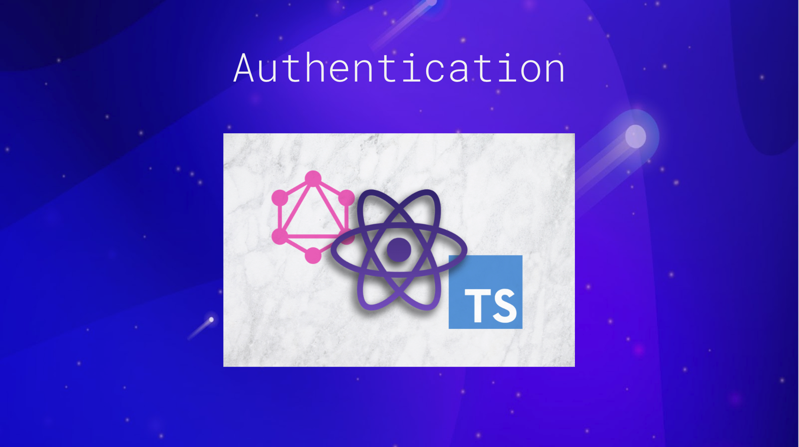

# React Apollo Graphql Authentication

## Demo

## Features

### Next Generation JavaScript with Typescript

- Stop worrying about browser support and use features like template strings, object destructuring, arrow functions, JSX syntax, and more today! Include Typescript in both client and server for high performing and robust code!

### Next Generation CSS

- Usage of styled-component that allow uses of the best bits of ES6 and CSS to style your apps without stress!

### Quick Scaffolding

- Automate the creation of components, containers, features - and their tests - right from the CLI! Avoid fighting the glue of your code and focus on your app!

### GraphQL

- GraphQL is an open-source data query and manipulation language for APIs, and a runtime for fulfilling queries with existing data

## Client

- Typescript
- Apollo Client - Apollo Client is a complete state management library for JavaScript apps.
- Form hook libray - react-hook-form
- Private Route, authorize protected route
- Form validation using yup.js scehma base validation
- Login - a container that handle loging in user to private route
- Register - autocomplete username availability,
- AntD - ui library
- Animation - react-spring

## Server

- Typescript
- Apollo Server - Apollo Server is the best way to quickly build a production-ready, self-documenting API for GraphQL clients
- JsonWebToken - URL-safe means of representing claims to be transferred between two parties.
- Bcrypt - A library to help you hash passwords.
- Login
- Register
- MongoDB

## TODO

- Client test coverage
- Server test coverage
